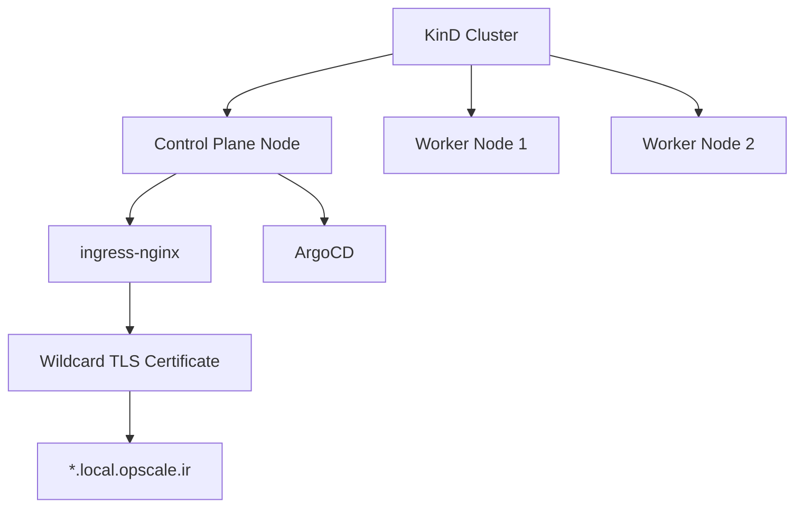
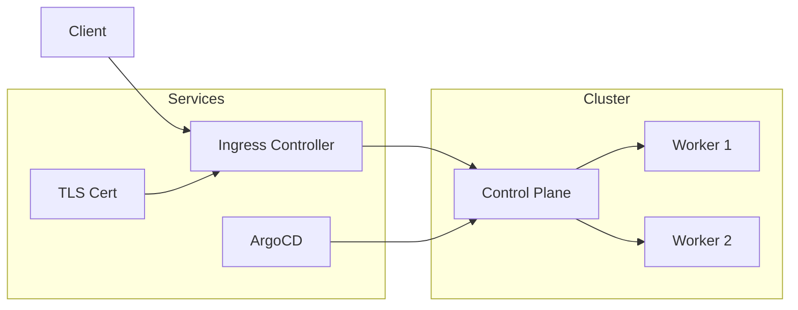

# KinD Cluster with GitHub Container Registry Support

A customized KinD (Kubernetes in Docker) configuration with GitHub Container Registry (GHCR) integration, ingress-nginx, and ArgoCD support.

## Architecture



## Features

- 🔄 Custom node images from GHCR
- 🔐 Automatic TLS certificate management
- 🚀 Pre-configured ingress-nginx controller
- 📦 Built-in ArgoCD for GitOps
- 🔄 Weekly certificate renewal

## Quick Start

1. **Create the cluster**
```bash
curl "https://raw.githubusercontent.com/OpScaleHub/kind/refs/heads/main/clusterConfiguration.yaml" | \
  kind create cluster --config -
```

2. **Configure ingress controller**
```bash
# Label the control-plane node
kubectl label nodes kind-control-plane ingress-ready=true

# Deploy ingress-nginx
kubectl apply -f https://raw.githubusercontent.com/kubernetes/ingress-nginx/controller-v1.8.2/deploy/static/provider/kind/deploy.yaml
```

3. **Install TLS certificate**
```bash
# Deploy wildcard TLS certificate for *.local.opscale.ir
curl -L "https://github.com/OpScaleHub/kind/releases/download/stable/wildcard-tls.yaml" | \
  kubectl apply -f -
```

4. **Deploy ArgoCD**
```bash
kubectl create namespace argocd
kubectl --namespace argocd apply -f \
  https://raw.githubusercontent.com/argoproj/argo-cd/refs/tags/v2.14.8/manifests/core-install.yaml
```

5. **Wait for components**
```bash
kubectl wait --timeout=5m --namespace argocd        --for=condition=Available deployments --all
kubectl wait --timeout=5m --namespace ingress-nginx --for=condition=Available deployments --all
kubectl wait --timeout=5m --namespace ingress-nginx --for=condition=Complete  jobs        --all
kubectl wait --timeout=5m --namespace ingress-nginx --for=condition=Ready     pod --selector app.kubernetes.io/component=controller
```

## Demo Application

Deploy a sample application to verify the setup:

```bash
# Create and expose deployment
kubectl create deployment k8s --port=8080 --image=gcr.io/google-samples/node-hello:1.0
kubectl expose deployment k8s --port=8080

# Configure ingress
kubectl create ingress k8s --rule="local.opscale.ir/*=k8s:8080,tls=wildcard-tls" --class=nginx

# Verify deployment
kubectl wait --for=condition=available --timeout=60s ingress/k8s

# Test the endpoint
curl -k https://local.opscale.ir
```

## Component Versions

- KinD Node Image: `v1.32.3`
- ingress-nginx: `v1.8.2`
- ArgoCD: `v2.14.8`

## Architecture Details



## Contributing

For bug reports and feature requests, please open an issue in the GitHub repository.
